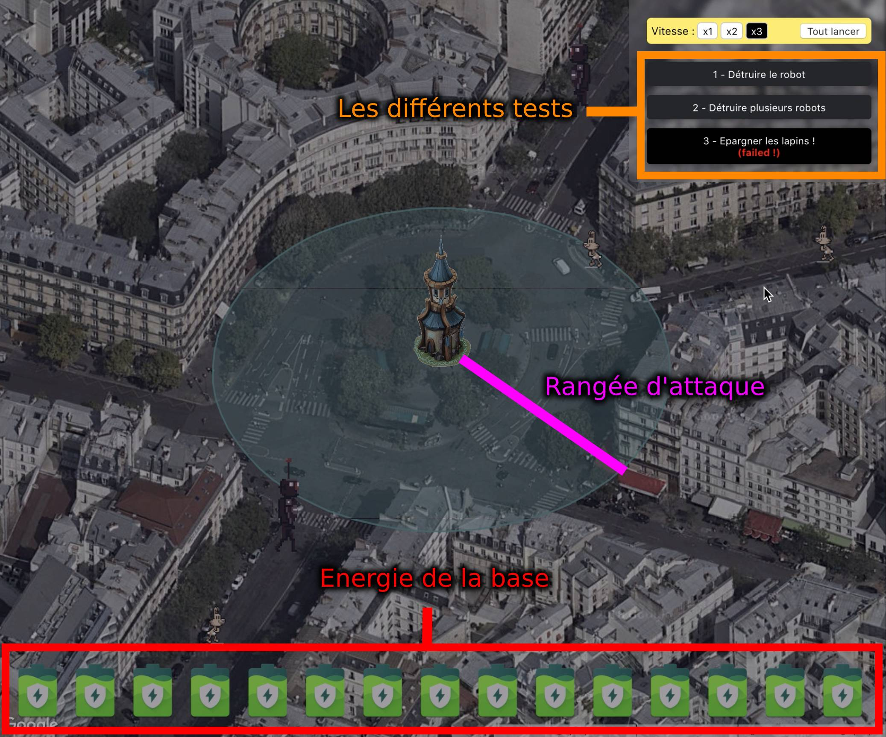

# Tower Defense

> **But du jeu** : Détruire tous les ennemis, sans éliminer un seul lapin, attention à la vitesse de déplacement ainsi qu'à l'énergie consommé.

## Procédure

1. Forker le projet (le laisser en visibilité privé).
2. Récupérer votre fork localement (`git clone ...`)
3. Installation, lancer `yarn` ou `npm install`.
4. Lancer le jeu via `yarn start` ou `npm start`
5. Faire le maximum de test dans le temps imparti (penser à commit régulièrement).
6. Donnez-nous un accès à votre fork pour la validation du test.

## Introduction

A une époque pas si lointaine, des robots envahissent la ville. Après avoir récupéré des pièces de ses robots et extrait leur technologie nous avons construit une tour de défense. Celle-ci permet de les tuer en un seul rayon laser. Nous sommes des développeurs codant une AI efficace pour détruire ces robots et éradiquer toute invasion.

### A savoir:

- Les ennemis ne se déplacent que vers nous.
- Ils ont une vitesse constante.
- Ils n'attaquent pas à distance, il faut qu'ils soient au niveau de la tour pour la détruire.
- La tour les détruit en un seul tire.
- La tour se fait également détruire en un seul coup.
- Il ne faut pas tuer les lapins !
- Au début il n'y a qu'un seul test, ils se dévérouillent automatiquement à chaque fois qu'un test réussi.



## Fonction

Un fichier est disponible, contenant le code de la tour [./src/playground/playground.ts](src/playground/playground.ts), seul ce fichier doit être modifié. Le but est de développer le code qui nous permette de nous en sortir dans tous les cas !

La fonction `yield* readLine()` nous renvoie une chaine de caractère contenant des informations à extraire, séparés par des espaces.

Différentes informations sont données à l'initialisation :

```
Ligne 1: "<base latitude> <base longitude> <base attack range (meters)> <base energy>"
Ligne 2: "<nb actors>"
Ligne 3: "<actor id> <actor type (robot|rabbit)> <actor speed (km/>h)>"
```

- `<base latitude>` Position latitude de la base
- `<base longitude>` Position longitude de la base
- `<base range>` Distance d'attaque possible de la tour en mètres
- `<base energy>` Energie de la base, elle se vide de 1 à chaque tire.
- `<nb actors>` Nombre d'entités sur la map (robots + lapins).

Pour chaque entité, les données suivantes sont renvoyées :

- `<actor id>` Id de l'entité (est utilisé pour tirer par exemple)
- `<actor type>` Type de l'entité (`robot`, `rabbit`)
- `<actor speed>` Vitesse de l'entité en `km/h`

---

Par la suite nous avons un `while (true) {`. C'est une boucle qui est exécutée à chaque tour. Dans celle-ci nous allons donc récupérer des informations sur chaque ennemi (vivant/mort, position, ...) et devoir faire une action :

- Passer son tour : `yield* wait();`
- Tirer sur un ennemi : `yield* shotTarget('terminator');`

Donc à chaque tour, on va recevoir des données sur chacun des ennemis (récupéré par `yield* readLine();`) :

```
<actor id> <actor status (alive|dead)> <actor latitude> <actor longitude>
```

- `<actor id>` Id de l'entité concerné
- `<actor status>` Status de l'entité (`alive`, `dead`).
- `<actor latitude>` Position latitude mis à jour
- `<actor longitude>` Position longitude mis à jour

Il faut par la suite renvoyer une string au générateur, qui nous dira l'action à effectuer, 2 choix possibles :

- Passer son tour : `yield* wait();`
- Tirer sur un ennemi : `yield* shotTarget(<actor id>);`

## Exemple

### Input

```
48.87810866590708 2.2982083106974187 50 100
3
terminator robot 50
robocop robot 25
biscuit rabbit 70
terminator alive 48.87748749208476 2.2977000320890966
robocop dead 48.87892191796553 2.2986857439020696
biscuit alive 48.87844544367027 2.2996044004896703
```

### Output

```
yield* shotTarget('terminator');
```
